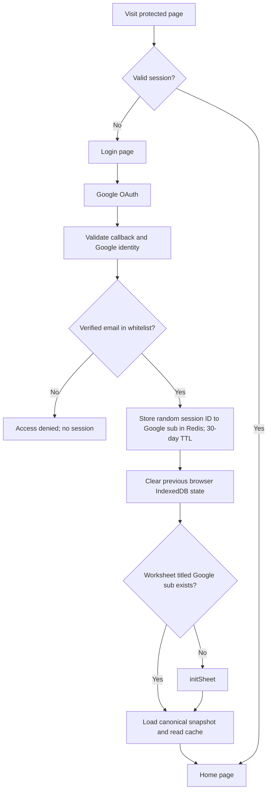
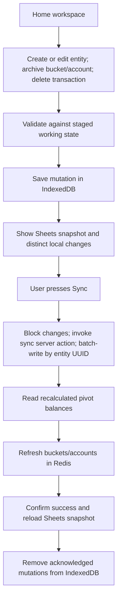

# Buckets application design

This document is a reference for the application's architecture, data model, user flows, and design decisions. Confirmed behavior and proposed defaults are distinguished where decisions remain open.

## 1. Scope

Buckets is a personal finance application designed around Next.js, Google identity, an environment-configured whitelist, Redis sessions and read caches, browser IndexedDB staging, and Google Sheets persistence through a service account.

### Required behavior

- Google authentication checks the verified email against a whitelist from `.env` at login. Redis stores `session:<random-session-id> -> <google-sub>` with a 30-day expiration; the cookie contains only the random session ID.
- Each user has a worksheet titled exactly their Google `sub`, created through `initSheet` when missing. Sheets contains no application metadata.
- Each worksheet contains four entity ranges and account/category balance pivots.
- Permitted entity changes are staged in IndexedDB. Only explicit **Sync** writes them to Sheets in a batch.
- IndexedDB has three object stores: `creates`, `updates`, and `deletes`. Changes are disabled during sync. There are no lifecycle IDs, fingerprints, batch IDs, or persisted IndexedDB snapshots.
- Only transactions can be deleted. Categories cannot be deleted or archived. Accounts cannot be deleted and can only be archived. Buckets cannot be deleted and can be archived only when every account belonging to them is archived.
- Spreadsheet pivots compute balances; sync refreshes bucket/account views in Redis.
- Login/logout clears IndexedDB. Staging reduces spreadsheet writes; offline operation is not a product goal.
- The five routes are `/`, `/login`, `/google/auth`, `/google/auth/callback`, and `/logout`. Entity management and sync live within home, using server components/actions and client components for browser interactions.

### Proposed defaults

The following sections describe ownership, money, retries, and concurrent edits. Proposed defaults are distinguished from confirmed behavior. Archive and delete permissions are confirmed. Section 10 collects open design questions.

## 2. Architecture and ownership

| Component | Responsibility |
| --- | --- |
| Next.js server components | Render login and authenticated home, load canonical data, and compose entity sections and forms |
| Next.js server actions/services | Authenticated worksheet provisioning/recovery, snapshot refresh, sync validation, Sheets writes, and Redis refresh |
| Client components | Interactive forms, IndexedDB staging, local-change views, sync controls, and browser login/logout cleanup |
| Authentication route handlers | Google identity handshake and logout at the explicitly allowed paths |
| Browser IndexedDB | Pending local changes in `creates`, `updates`, and `deletes`, cleared on login/logout |
| Google Sheets | Durable source of truth for committed entities and pivot-derived balances |
| Redis | 30-day session-ID-to-`sub` mapping, committed bucket/account read cache, and per-user sync coordination |
| Google service account | Server-side access to the application's spreadsheet |

Google OAuth establishes identity. The service account accesses spreadsheet data independently of the user's OAuth credentials. Credentials, session records, and whitelist configuration remain server-side.

Google's stable subject (`sub`) is the user ID and exact worksheet title. The login whitelist check uses a normalized verified email. The Redis session value contains only `sub`, excluding email, profile, and OAuth tokens. Whitelist changes apply at the next login; revoking an existing session requires deleting its Redis key.

Worksheet lookup uses the title derived from the session's `sub`; its returned numeric sheet ID supports operations requiring that ID. No persisted owner mapping is needed. Titles are app-controlled; manual renaming would break lookup.

Every query and mutation is scoped to the authenticated user. Client-supplied owner IDs, worksheet IDs, or guessed entity UUIDs do not authorize access to another user's data.

## 3. Entity model

All UUIDs are generated before staging a create so that related entities can reference each other before the first sync. UUIDs remain stable throughout the entity's lifetime. Ownership is implicit in the user's worksheet rather than an extra entity column.

| Entity | Fields |
| --- | --- |
| Bucket | `id: uuid`, `name: string`, `archived: boolean = false` |
| Category | `id: uuid`, `name: string` |
| Account | `id: uuid`, `name: string`, `bucketId: uuid NOT NULL`, `archived: boolean = false`, `balance: integer = 0` |
| Transaction | `id: uuid`, `date: date`, `amount: integer NOT NULL`, `accountId: uuid NOT NULL`, `categoryId: uuid OR NULL` |

### Validation and proposed accounting rules

- Names are trimmed and nonempty. Duplicate names may exist; references and pivots use UUIDs.
- Proposed money representation is integer minor units with one currency/scale per user, bounded by safe integer limits for amounts and aggregates.
- Proposed sign convention: a positive transaction increases the account balance; a negative transaction decreases it. Zero amounts remain valid unless the product decides otherwise.
- Proposed transaction date representation is a required calendar date (`YYYY-MM-DD`) initialized to the user's local current date, without implicit timezone conversion.
- An account must reference an existing bucket; a transaction must reference an existing account. A non-null category must exist in the same user's final staged dataset.
- Account balance is derived from the sum of its committed transactions. It starts at zero and is not directly editable. An opening balance is represented as a transaction under this proposal.
- A bucket's aggregate balance is derived from its accounts; it is a cached presentation value, not an extra required bucket column.
- Category is optional. Reporting includes an uncategorized group.

### Archive and delete behavior

These permissions are required:

| Entity | Archive | Delete |
| --- | --- | --- |
| Bucket | Allowed only when every account belonging to it is archived | Never allowed |
| Category | Never allowed | Never allowed |
| Account | Allowed; retain its transactions and balance | Never allowed |
| Transaction | Not supported | Allowed; recompute its account balance on sync |

Archived buckets and accounts stay visible through an archive filter, retain balances and history, and are excluded from new-transaction choices. Archiving a bucket must not automatically archive its accounts: the accounts must already be archived in the final staged state. A bucket with no accounts satisfies this condition.

Archive eligibility uses the final staged dataset, allowing all accounts and their bucket to be archived in one sync. An active account cannot belong to an archived bucket, including through creation, reassignment, or restoration. The UI identifies accounts preventing bucket archiving; server validation applies the same rules.

Bucket/account/category deletion and category archiving are unsupported in both the UI and server validation. Deletion does not cascade. Restoration remains an open decision.

## 4. Authentication and worksheet initialization

### Login procedure

1. An unauthenticated visitor sees `/login`. OAuth starts at `/google/auth` and returns to `/google/auth/callback`.
2. Callback verification covers state/CSRF protection, authorization-code exchange, and the ID token's signature, issuer, audience, expiration, subject, and verified email.
3. The verified email is checked against the whitelist. Denied identities receive neither a session nor a new worksheet. Subsequent protected requests validate the Redis session, which stores no email.
4. A cryptographically random session ID maps to `sub` in Redis with a fixed 30-day TTL. The cookie contains only that session ID, with HttpOnly, Secure in production, appropriate SameSite, and matching lifetime. Proposed default: no sliding expiration.
5. The callback redirects home with a one-time login-completion signal, such as a short-lived flag cookie. Client cleanup clears IndexedDB and consumes the signal before enabling interactions. Ordinary reloads retain pending changes; a server redirect alone cannot clear browser storage.
6. Worksheet lookup uses the session's `sub`. A missing worksheet enters `initSheet`; initialization and retry states appear within home. The workspace becomes interactive once initialization and browser cleanup succeed.

`initSheet` creates the worksheet titled `sub`, four entity tables with headers, and pivot areas. It stores no owner ID, schema version, initialization flag, revision, batch marker, or other application metadata in Sheets. Coordinate concurrent first logins through Redis and recheck the title before creating. Determine readiness by inspecting the expected headers, ranges, and pivot definitions against the schema defined in code. Repair partial initialization without replacing existing entity data. Initialization errors leave an authenticated user on a retryable state within home.

Target identity scopes are `openid`, `email`, and `profile`. The starter also requests Sheets/Drive scopes, while the target design delegates spreadsheet access to the service account. Raw OAuth tokens are not exposed to the browser.

### Logout and session expiry

Logout uses `/logout`: its server handler invalidates the Redis session, clears the session cookie, and returns to login. Client cleanup must clear the app's IndexedDB state and notify other tabs; a logout-completion signal consumed on `/login` also covers direct visits to `/logout`. Login also clears any previously staged changes, even for the same user. These actions intentionally discard unsynced changes; show a pending-change warning before user-initiated logout and offer Sync or Discard.

On session expiry or revoked access, block sync and protected reads and route through login. Reauthentication clears staging as required. Never submit a previous user's changes after a new login. Broadcast login/logout events across tabs so stale tabs clear pending changes and invalidate their loaded Sheets snapshot. Require those tabs to reload authenticated state before staging or syncing again; no separate lifecycle ID is needed.

## 5. Spreadsheet layout and calculations

One shared spreadsheet contains one worksheet per user. The service account has permissions to create worksheets and edit tables/pivots. The UI exposes only the authenticated user's data.

Four horizontally separated entity ranges allow row growth without overlapping another table. Separate columns contain pivots. Coordinates and headers are defined in application code:

| Range | Column order |
| --- | --- |
| Buckets | `id`, `name`, `archived` |
| Categories | `id`, `name` |
| Accounts | `id`, `name`, `bucketId`, `archived`, `balance` |
| Transactions | `id`, `date`, `amount`, `accountId`, `categoryId` |
| Account balances pivot | Account UUID grouped against sum of transaction amount |
| Account/category pivot | Account UUID and category UUID grouped against sum of transaction amount |

Pivots aggregate by UUID; display names come from entity tables so renaming does not split history. Reporting includes uncategorized rows. Accounts absent from pivot output because they have no transactions receive a zero balance.

Account `balance` cells are derived projections populated from the account pivot, not independent ledger data. After mutations, confirmed pivot totals refresh account balance cells and Redis views. Recalculation readiness is checked before balances appear as confirmed. Bucket totals include associated archived accounts in historical balances.

Sheets contains only entity tables, headers, and pivot/calculation areas, with no application metadata in cells or developer metadata. Ownership comes from the title, schema from code, and write coordination from Redis. Entity writes exclude headers/calculation areas. Names are literal text rather than executable spreadsheet formulas.

## 6. IndexedDB staging and entity flows

IndexedDB stores pending changes, not an offline dataset. The Sheets snapshot lives in application memory/query state and is visually separate from local changes. Neither snapshots nor sync bookkeeping are persisted in IndexedDB. Connection failures produce retryable errors.

The three object stores are keyed by `localid`:

| Object store | Record shape |
| --- | --- |
| `creates` | `{ localid, entityType, payload: Entity }` |
| `updates` | `{ localid, entityType, identifier: entity.id, payload: Partial<Entity> }` |
| `deletes` | `{ localid, entityType: "transaction", identifier: entity.id }` |

`Entity` is a bucket, account, category, or transaction. `entityType` is a discriminator (`bucket`, `account`, `category`, or `transaction`) so the server knows which range to access. `identifier` is the entity UUID (`id` in Section 3); create payloads include this UUID from the start. `localid` is a separate UUID identifying the pending change in the browser, not a Sheets row, batch, or server commit marker. Updates cannot change an entity's UUID or derived balance.

There is at most one pending operation per entity type/UUID. Cross-store moves are atomic, and local views derive from these records without another persisted working copy. A reload fetches the Sheets snapshot and reads pending records; login/logout clears them.

No lifecycle IDs, fingerprints, batch IDs, or separate sync metadata store are required. Concurrent edits from different devices use last-sync-wins for the submitted fields rather than conflict detection.

### Create

From home, choose an entity type, fill its form, and stage it. Account forms require a bucket; transaction forms require an account and optionally a category. Selectors include newly staged parents, allowing a bucket, account, category, and transaction to be created in one sync. Show a persistent pending-change count and an **Unsynced** marker.

### Update and archive

Edits are staged from the working view and appear immediately. Archive is an update to a bucket/account's flag; a bucket requires all its accounts to be archived in the final staged state. Categories have no archive action. Restoration is an open question in Section 10. Pending account/bucket totals may be computed locally for immediate feedback and appear as provisional until pivot-derived totals arrive from sync.

### Delete

Only transactions support deletion. For a committed transaction, remove any pending update and add a record to `deletes`; show it as pending deletion beside the Sheets snapshot. Undo removes the delete record. For a locally created transaction, remove its `creates` record; no server delete is needed. Reject delete operations for all other entities in both the client and server.

### Queue compaction

Editing a pending create updates its existing `creates` payload directly and retains its `localid`. Editing a committed entity creates one `updates` entry; subsequent edits merge into its partial payload and retain its `localid`. For transactions, create then delete removes the create, and update then delete replaces the update with a delete. Do not allow edits while a transaction is pending deletion unless that deletion is first undone.

Cancelling a form or explicitly discarding pending changes is distinct from deleting a committed entity. Validate relations and archive eligibility against the Sheets snapshot combined with local changes. Discard clears the three pending stores and reloads the Sheets snapshot. Disable create, edit, archive, delete, undo, discard, logout, and duplicate Sync actions while sync is running, including in other tabs sharing the pending stores.

## 7. Sync protocol and retries

Sync is explicit, without automatic sync on form submission, navigation, reload, login, or logout. Provisioning and derived-data/cache repair are separate maintenance operations.

1. Block all pending-change actions across tabs and read the `creates`, `updates`, and `deletes` records. Invoke the sync server action from the home page with those three arrays; no batch UUID or base fingerprint is sent. Keep changes blocked until the action completes or returns an error. There is no sync page or API route.
2. Authenticate through the Redis session, resolve the worksheet titled `sub`, and coordinate server-side sync per user in Redis. Serialize requests so two devices do not write overlapping worksheet ranges simultaneously. This is write coordination, not version/conflict tracking.
3. Read the latest canonical entity data. Apply creates, partial updates, and transaction deletes to that data in memory, then validate the final dataset: field types, safe integers, UUID uniqueness, references, permitted mutation types, and archive constraints. Only transactions may be deleted; an archived bucket must contain only archived accounts.
4. Resolve all operations by entity type and UUID, never by a client row number or `localid`. A create inserts only if its UUID is absent; if already present, treat it as already created and preserve the existing row. An update sets the submitted fields on the existing UUID and preserves unspecified fields; reject an update whose entity is missing. A transaction delete removes that UUID if present and succeeds if already absent. Do not blindly append creates on retries.
5. Batch-write the resulting entity changes. For the initial small-data implementation, deterministic replacement of affected ranges is acceptable when based on the freshly read canonical dataset under per-user coordination; clear stale trailing rows on shrink. Do not store commit markers or application metadata in Sheets.
6. Read recalculated pivots, refresh derived account balance cells, and replace the user's Redis bucket/account views as one logical snapshot. Even when a retry requires no new entity writes, complete balance calculation/cache refresh.
7. Return success only after Sheets writes, balance finalization, and cache refresh complete, with the refreshed canonical snapshot and confirmed balances. Clear the submitted pending records atomically across the three stores, reload the snapshot, and re-enable changes. `localid` can identify records being cleared but has no server retry meaning.

Sheets writes, pivot calculation, Redis refresh, and browser acknowledgement are separate stages, not a distributed atomic transaction.

Stable entity UUIDs make replaying the same settled request safe against duplicate creates and already-applied deletes; repeated partial field assignments are also idempotent. No Redis retry ledger is required. This does not provide exactly-once delivery or stale-edit detection. Different devices use last-sync-wins for updates to the same fields; an old retry can overwrite a newer value in those fields. Unknown requests must remain serialized with retries until the prior server operation ends. Do not offer simultaneous retries while an earlier write may still be in flight.

| Failure | Required behavior |
| --- | --- |
| Validation failure | Keep staging intact; show field/reference errors; no spreadsheet write |
| Competing device edits | Serialize sync requests; merge partial updates into the latest data and use last-sync-wins for the same fields |
| Definite failure before commit | Keep all pending records and retry |
| Timeout / unknown commit outcome | Keep pending records; serialize retries behind the prior operation and reread Sheets before applying UUID-based operations |
| Sheet committed, pivot/cache refresh failed | Keep pending records and show finalization failure; retry by UUID and refresh balances/cache without duplicate creates |
| Response lost after success | Keep pending records; retry by entity UUID, not blind append |
| Redis coordination lost | Stop admitting writes until serialization can be restored; session-key loss may require login |
| Expired session | Stop sync; explain that login clears pending changes under the required lifecycle rule |

For a valid Redis-backed session, a missing/stale entity cache can be rebuilt from the worksheet titled `sub`. No mapping metadata is required. If Redis itself is unavailable, session validation and sync coordination are unavailable: return a retryable error rather than bypass authentication. If session keys are lost, require login. Sheets remains the durable entity source of truth.

## 8. Allowed routes and home components

Only these five paths are allowed:

| Route | Description |
| --- | --- |
| `/` | Authenticated home workspace, server-rendered data, worksheet initialization/retry state, all entity management, and local-change review/sync |
| `/login` | Google sign-in button, whitelist access explanation, denied/failed sign-in messages, and browser logout cleanup |
| `/google/auth` | Route handler that starts the Google OAuth handshake |
| `/google/auth/callback` | Route handler that verifies Google identity and whitelist membership, establishes the Redis session, and redirects home |
| `/logout` | Authentication handler that revokes the session, clears its cookie, and redirects to login with browser cleanup completion |

Entity lists, details, and forms occupy sections, panels, or dialogs within `/`:

| Home component | Description |
| --- | --- |
| Overview | Bucket/account balances, archive visibility, quick create actions, recent transactions, and pending-change count |
| Buckets | List and detail with aggregate balances and accounts; create/rename form; archive allowed only when all accounts are archived; no deletion |
| Accounts | List/detail filtered by bucket/archive, transactions and category totals; name and required bucket form; read-only balance; archive action; no deletion |
| Categories | List and name forms for create/rename; no archive or deletion |
| Transactions | Date/account/category filters, signed amounts, create/edit forms with required account and optional category, and transaction-only deletion |
| Local changes and sync | Distinct creates/updates/deletes review alongside the Sheets snapshot; explicit Sync, errors/retries, finalization status, discard/undo; changes disabled during sync |

Server components load authenticated data and compose the home workspace and form layouts. Client components handle interactive fields, selections, dialogs, IndexedDB writes, and local pending-change rendering. Server components cannot access IndexedDB; saving an entity form stages a browser change and does not write Sheets. Sync invokes a server action only when explicitly requested.

Initialization/loading/empty/error states appear in the existing pages. Inaccessible selections produce a scoped not-found state within home. There are no entity, setup, sync, or `/api/*` routes.

## 9. Server interface and configuration

Server boundaries follow the five routes in Section 8:

- Google authentication and logout use the explicitly allowed authentication handlers.
- Session lookup, worksheet readiness, canonical snapshot loading, and Redis home reads are server-only services called by server components; no read API endpoints.
- Initialization/recovery and explicit data refresh use server actions where an interactive retry or refresh is needed.
- `syncChanges({ creates, updates, deletes })` is a server action accepting the Section 6 record shapes. It returns the refreshed canonical snapshot on success or structured validation/retry/finalization errors. No lifecycle ID, fingerprint, or batch ID.

Each server action authenticates and authorizes independently, validates client arguments, and has CSRF protection appropriate to its invocation. Entity persistence remains behind IndexedDB staging and explicit sync, without entity/sync route handlers.

Existing configuration names are `GOOGLE_OAUTH_CLIENT_ID`, `GOOGLE_OAUTH_CLIENT_SECRET`, and `GOOGLE_OAUTH_CALLBACK_URL`. Proposed additions are `AUTH_EMAIL_WHITELIST` (comma-separated verified emails), `GOOGLE_SPREADSHEET_ID`, `GOOGLE_SERVICE_ACCOUNT_EMAIL`, `GOOGLE_SERVICE_ACCOUNT_PRIVATE_KEY`, and `REDIS_URL`. These values are server-only. Missing/invalid authentication configuration denies access.

## 10. Open design questions

- Currency/minor-unit scale, transaction sign convention, required date, and opening-balance representation.
- Whether archived buckets/accounts can be restored. An active account still requires an active bucket in the final staged state.
- Whether direct spreadsheet editing is supported. Proposed initial scope: all edits go through the app; manual edits during sync are outside its write coordination.
- Expected transaction volume, pagination needs, and suitability of affected-range replacement.
- Pending-change warning experience for logout and reauthentication. Login/logout intentionally discard unsynced data.
- Per-user server sync coordination and lock lifetime/renewal, including retries behind in-flight writes.
